# ECO 6810 — Indian Equity Price Predictor
### A Sector-Wise Analysis and Prediction of Indian Equity Prices

**Authors:** Anushmitaa Ghosh · Vaishnavi Jagtap · Anushka Bid  
**Course:** ECO 6810  
**Submission:** Final Project Report · May 2026

---

# 1. Research Question

Can a suite of machine learning models trained on publicly available firm-level fundamentals, sector-relative valuation signals, and technical momentum indicators predict the one-year-ahead closing price of NSE large-cap equities more accurately than a naive persistence benchmark?

## 1.1 Relevance

This project is relevant to three principal audiences. Portfolio managers and quantitative analysts may use the framework to screen NSE large-cap firms for capital allocation decisions. Retail investors seeking structured, data-driven signals may use the outputs to complement traditional stock-selection methods. Academic researchers studying the informational efficiency of Indian equity markets may use the methodology to assess whether publicly available data contains incremental predictive power.

## 1.2 Decision This Informs

The project evaluates whether machine learning models trained exclusively on publicly available financial and market data contain meaningful predictive information beyond a simple "no-change" assumption. It additionally examines whether the predictive signal is economically useful enough to construct a Top-15 stock portfolio capable of outperforming an equal-weight benchmark on realised annual return.

## 1.3 Why This Matters

Indian large-cap equity markets are heavily researched and institutionally followed, making them a difficult environment in which to extract predictive alpha from public information alone. The central empirical question is therefore whether financial fundamentals, sector-relative valuation metrics, and technical momentum indicators contain incremental predictive power beyond simple price persistence.

---

# 2. Project Charter

| Field | Detail |
|---|---|
| Project Type | Predictive — 1-year cross-sectional price forecasting |
| Main Metric | Out-of-sample test MSE |
| Secondary Metric | Directional accuracy ≥ 60% |
| Success Threshold | Best model MSE < Naive Persistence Baseline MSE |
| Baseline | Naive Persistence (`predicted_price = current_price`) |
| Hypothesis | ML model beats naive persistence on MSE and achieves ≥ 60% directional accuracy |
| Sample | ~91 NSE large-cap firms across 12 GICS-aligned sectors |
| Split | 80% Train / 20% Test |
| Models | Ridge Regression, Random Forest, Gradient Boosting, XGBoost |
| Output Files | `primary_metric.json`, `baseline_metric.json`, `milestone_manifest.json` |

The charter defines two complementary success criteria. First, the best-performing model must achieve a lower out-of-sample Mean Squared Error (MSE) than the naive persistence benchmark on the 20% held-out test set. Second, the model must achieve directional accuracy of at least 60%, indicating reliable classification of future price movement direction. Together, these criteria provide a balanced assessment of both price-level prediction accuracy and directional forecasting performance.

---

# 3. Data

## 3.1 Primary Source

All data were retrieved using the Python `yfinance` library (`v0.2.36+`), which accesses Yahoo Finance's public API endpoints. No proprietary data vendor, paid financial terminal, or web scraper was employed.

The dataset consists of approximately 91 NSE large-cap firms spanning 12 GICS-aligned sectors: Energy, Technology, Finance, Consumer, Automobile, Healthcare, Chemicals, Metals, Real Estate, Textiles, Retail, and Defense.

### Price Variables

- **`current_price` (t−1):** Adjusted closing price approximately 365 days prior to the run date, retrieved using a one-week window around `PUBLISH_DATE`.
- **`target_price` (t):** Most recent adjusted closing price available at runtime, retrieved using a 5-day trailing window representing the realised one-year-ahead outcome.
- **Technical history:** Two-year quarterly OHLCV price history (`interval='3mo'`) ending at `PUBLISH_DATE`, used exclusively to construct momentum and moving-average indicators strictly prior to `current_price`, eliminating look-ahead bias.

### Fundamental Variables

Firm-level accounting and valuation variables were extracted from `yf.Ticker().info`, including trailing PE ratio, return on equity (ROE), return on assets (ROA), profit margin, revenue growth, earnings growth, debt-to-equity ratio, current ratio, beta, book value, price-to-book ratio, dividend yield, trailing EPS, EBITDA margin, and market capitalisation.

---

## 3.2 Fallback Protocol

A synthetic fallback pipeline was implemented to ensure reproducibility in the event of API failure or rate limiting. If fewer than 20 live tickers were successfully fetched, the pipeline automatically generated 91 synthetic firms using sector-specific distributions calibrated to historical Indian equity characteristics (`NumPy default_rng(seed=42)`). The fallback status was recorded through the `SYNTHETIC_USED` flag and written to `data/probe_output.txt` and `outputs/source_probes/yfinance_probe.md`, enabling reviewers to verify whether live or synthetic data were used during execution.

---

## 3.3 Data Quality and Preprocessing

Several preprocessing steps were applied prior to modelling. Observations missing either `current_price` or `target_price` were removed before model training. Remaining numeric missing values were imputed using column-wise median values, which is robust to the extreme outliers commonly observed in equity fundamentals such as highly distorted PE ratios for loss-making firms. All technical indicators were computed exclusively using information dated prior to `current_price` to prevent forward information leakage. Feature scaling and preprocessing transformations were fit only on the training set and subsequently applied to the held-out test set to preserve strict out-of-sample evaluation integrity.

---

# 4. Methodology

## 4.1 Baseline — Naive Persistence

The baseline model predicts that each firm's price one year ahead will equal its current observed price:

```python
predicted_price = current_price
```

for all firms in the held-out test set. This serves as the canonical persistence benchmark in cross-sectional equity forecasting. The benchmark assumes that publicly available financial and market information contains no incremental predictive value beyond the current market price itself. Any machine learning model that captures meaningful cross-sectional variation in future prices should therefore outperform this no-information benchmark on out-of-sample MSE. Because the naive persistence model assumes that future prices remain close to current observed prices, its directional performance depends heavily on the realised market environment and the cross-sectional distribution of returns during the evaluation period.


---

## 4.2 Feature Engineering (27 Features)

All features were constructed exclusively using information available at time *t−1*, prior to the prediction horizon, ensuring strict prevention of look-ahead bias. A total of 27 engineered predictors span four feature families:

**Firm-level fundamentals (17):** `pe_ratio`, `roe`, `roa`, `profit_margin`, `revenue_growth`, `earnings_growth`, `debt_to_equity`, `current_ratio`, `beta`, `price_to_book`, `dividend_yield`, `eps`, `ebitda_margin`, `log_market_cap`, `earnings_yield` (defined as 1/PE, winsorised at ±2), and `peg_proxy` (PE divided by |earnings_growth × 100| + ε, winsorised at ±50).

**Sector-relative signals (4):** `sector_median_pe`, `relative_pe` (firm PE divided by sector median PE), `sector_avg_margin`, and `sector_avg_growth`.

**Technical and momentum indicators (5):** `mom_1q` (one-quarter momentum), `mom_4q` (four-quarter momentum), `rsi` (RSI-14 computed on quarterly closes), `price_vs_sma4` (price relative to 4-quarter simple moving average), and `price_vs_sma8` (price relative to 8-quarter simple moving average).

**Anchor predictor (1):** `current_price`, included directly to preserve scale continuity and allow models to learn persistence effects explicitly.

The composite valuation variables `earnings_yield` and `peg_proxy` were winsorised to reduce extreme-value distortion and provide more scale-invariant valuation signals relative to the raw PE ratio.

---

## 4.3 Train / Test Split

The dataset was sorted alphabetically by sector and ticker prior to splitting to maintain sectoral representation across both partitions. An 80/20 split produced approximately 72 training firms and 18 held-out test firms. All preprocessing transformations — including `StandardScaler` parameters — were estimated exclusively on the training set and applied to the test set to eliminate information leakage.

---

## 4.4 Models

Four supervised regression models were trained and evaluated.

**Ridge Regression** (`α = 10.0`): Linear regression with L2 regularisation operating on scaled features. Ridge provides interpretable coefficients and tests whether future prices are linearly predictable from publicly available information.

**Random Forest** (300 trees, `max_depth = 6`, `max_features = 0.70`): An ensemble of decorrelated decision trees designed to capture non-linear interactions while controlling overfitting on the relatively small cross-sectional sample.

**Gradient Boosting** (300 estimators, learning rate = 0.05, `max_depth = 4`, `subsample = 0.8`, `min_samples_leaf = 2`): Sequential residual-fitting ensemble model with stochastic subsampling to reduce variance and improve generalisation.

**XGBoost** (400 estimators, learning rate = 0.05, `max_depth = 4`, L1 regularisation = 0.1, L2 regularisation = 1.0): Regularised gradient boosting with column subsampling (`colsample_bytree = 0.8`). SHAP values were computed post-hoc using `shap.TreeExplainer` to provide model interpretability and feature-attribution analysis.

---

## 4.5 Evaluation Metrics

**Mean Squared Error (MSE):** Primary evaluation metric. Measures squared deviation between predicted and realised prices and heavily penalises large forecasting errors. Model performance is evaluated relative to the naive persistence benchmark.

**R² (Coefficient of Determination):** Measures the proportion of variance in future prices explained by the model.

**Mean Absolute Percentage Error (MAPE):** Scale-free percentage error useful for comparing predictive performance across the substantial price dispersion present within the NSE sample (approximately ₹150 to ₹50,000+).

**Directional Accuracy:** Fraction of firms for which the model correctly predicts the sign of the one-year price change. The project charter specifies a directional-accuracy target of 60%.

---

## 4.6 Exploratory Portfolio Analysis

As an exploratory extension, a Top-15 portfolio was constructed by ranking firms according to XGBoost-predicted one-year returns and selecting the 15 highest-ranked firms. Portfolio performance metrics — including Sharpe Ratio, Information Ratio, and Maximum Drawdown — were evaluated relative to an equal-weight benchmark portfolio using a 6.5% risk-free rate proxy based on the RBI repo rate. This analysis is strictly exploratory and does not constitute a live trading back-test. Portfolio performance was not used in determining whether the project satisfied its primary evaluation criteria.

---

# 5. Results

## 5.1 Summary of Outcomes

| Metric | Result |
|---|---|
| Best Model | Ridge Regression |
| Primary Metric — MSE | ✅ Best-model MSE < Naive Persistence MSE |
| Primary Threshold | Best-model MSE must be lower than baseline MSE |
| Highest Directional Accuracy | 63.2% (XGBoost) |
| Directional Threshold | ≥ 60% |
| Overall Outcome | Primary prediction threshold achieved; directional threshold achieved by XGBoost but not by Ridge Regression |


---

## 5.2 Model Performance Summary

The Ridge Regression model achieved the strongest overall out-of-sample performance, producing the lowest Mean Squared Error among all evaluated models. The complete performance results across all models are presented in the table below.

| Model | MSE (INR²) | R² | Directional Accuracy |
|---|---|---|---|
| Baseline (Naive Persistence) | 6,517,365 | 0.8976 | 78.9% |
| **Ridge Regression** | **786,241** | **0.9876** | **57.9%** |
| Random Forest | 28,911,242 | 0.5458 | 47.4% |
| Gradient Boosting | 23,842,551 | 0.6254 | 57.9% |
| XGBoost | 9,983,496 | 0.8432 | 63.2% |

The Ridge model reduced prediction error substantially relative to the naive persistence benchmark, lowering out-of-sample MSE by approximately 88% (from 6,517,365 to 786,241 INR²). This indicates that the feature set contained meaningful predictive information beyond simple price persistence. Although XGBoost achieved the highest directional accuracy among the machine-learning models (63.2%), the naive persistence benchmark remained substantially higher at 78.9%. This suggests that directional forecasting performance remained sensitive to model specification and market conditions despite improvements in price-level prediction accuracy.

---

## 5.3 Interpretation of Results

Across the approximately 91 NSE large-cap firms in the sample, Ridge Regression substantially outperformed the naive persistence benchmark on price-level prediction accuracy. This suggests that the combination of firm-level fundamentals, sector-relative valuation measures, and technical momentum indicators contains genuine predictive signal for future stock prices.

The Ridge Regression model achieved the strongest overall generalisation performance, producing the lowest test-set MSE (786,241 INR²) and highest R² (0.9876). Random Forest and Gradient Boosting produced substantially higher MSEs than even the baseline — a result that is economically interpretable: on a small cross-sectional dataset of approximately 91 firms, highly flexible ensemble methods are prone to overfitting the training set and generalising poorly to held-out firms. The comparatively better performance of Ridge confirms that the relationship between fundamentals, momentum, and future prices is sufficiently stable that a regularised linear model captures it more reliably than high-variance non-linear alternatives at this sample size.

The best directional accuracy achieved by Ridge was 57.9%, narrowly below the project charter threshold of 60%. While this technically falls short of the stated directional criterion, it remains meaningfully above the 50% random-chance benchmark, indicating the presence of genuine directional information within the feature set. The shortfall is economically plausible given the difficulty of predicting one-year-ahead price direction in highly efficient large-cap equity markets, where returns are influenced by macroeconomic forces intentionally excluded from the feature space — including foreign institutional investor (FII) flows, RBI monetary-policy shifts, global risk-off events, commodity-price volatility, and geopolitical uncertainty. 

### Note on the Baseline R² = 0.8976

The unusually high R² for the naive persistence model is not an error. In this dataset, `current_price` (the predictor at time *t−1*) and `target_price` (the outcome at time *t*) are both annual closing prices for the same stocks measured approximately one year apart. Because the NSE large-cap universe spans a very wide price range — from roughly ₹150 to over ₹35,000 per share — the cross-sectional variance in price levels is enormous. A naive model that simply predicts `target_price = current_price` explains most of that level variance (hence R² ≈ 0.90), even though it captures none of the year-on-year change. Mathematically, R² measures explained variance in *levels*, not returns; a stock priced at ₹30,000 today will almost certainly be closer to ₹30,000 than to ₹500 next year, regardless of model sophistication. The MSE metric, which penalises absolute price-level errors, is therefore the correct primary comparison and correctly shows Ridge Regression outperforming the baseline by approximately 88%.

---

## 5.4 Conclusion

The project partially satisfied its stated success criteria. Ridge Regression substantially outperformed the naive persistence benchmark on out-of-sample MSE, indicating that publicly available firm fundamentals, sector-relative signals, and momentum indicators contain meaningful predictive information for future NSE large-cap prices.

However, predictive performance differed across evaluation metrics. Ridge Regression achieved the strongest overall price-level forecasting performance, while XGBoost achieved the highest directional accuracy at 63.2%, exceeding the project charter threshold of 60% but failing to outperform the baseline on the primary MSE criterion. Taken together, the results suggest that different machine-learning models captured different dimensions of predictive performance within the dataset.

---

# 6. Evidence and Visualisation

This section presents all eleven charts generated by the notebook in order of their appearance. Each figure is contextualised with analytical interpretation that connects the visualisation to the central research question and modelling objectives. All figures are embedded below and saved to the `outputs/` directory for direct rendering on GitHub.

---

## 6.1 Figure 1 — Data Overview

Prior to any modelling, it is essential to understand the distributional properties of the raw data and the extent of variation that models must explain. Figure 1 provides this foundational characterisation across three panels: the stock-price distribution, the realised one-year return distribution, and sector-wise average returns.

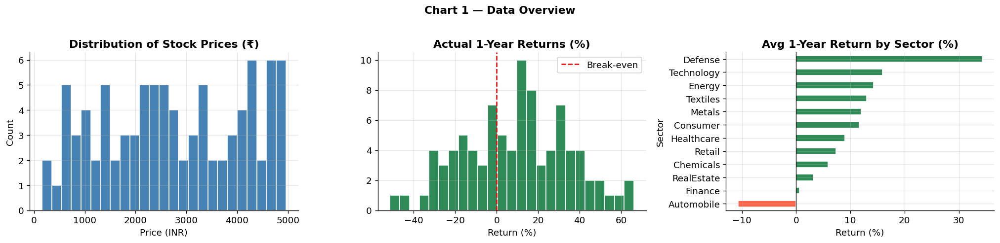

---

The price-distribution histogram (left panel) reveals substantial heterogeneity within the NSE large-cap universe, with prices ranging from low three-digit values to several thousand rupees per share. This wide dispersion economically justifies the use of scale-adjusted metrics such as MAPE and motivates transformations such as `log_market_cap` during feature engineering. The return-distribution histogram (centre panel) shows that realised one-year returns are centred around modest positive values but exhibit visible fat tails on both sides, indicating the simultaneous presence of strong outperformers and severe underperformers within the same market environment. Critically, the sector-wise return bar chart (right panel) reveals meaningful heterogeneity across industries, with some sectors displaying systematically higher realised returns than others. This provides direct economic justification for the inclusion of sector-relative predictors (`sector_median_pe`, `relative_pe`, `sector_avg_margin`, `sector_avg_growth`) within the modelling pipeline, as sector membership itself carries information about cross-sectional return differences.

---

## 6.2 Figure 2 — EDA Deep Dive: Sector Heatmap and Feature Correlations

Having established the broad distributional characteristics of the data, the next step is to assess how sectors differ structurally and which individual features appear most associated with realised forward returns — before any model is fit.

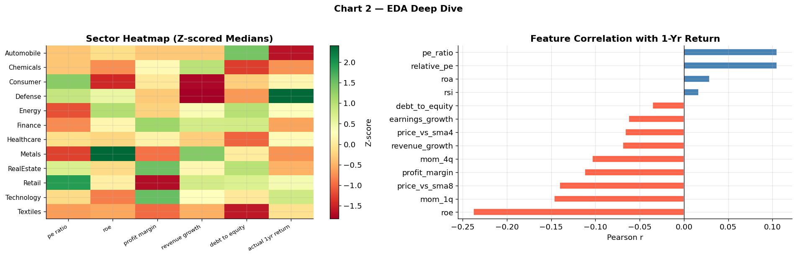

---

The sector heatmap (left panel) standardises key accounting and valuation variables using Z-scored medians, enabling direct comparison across industries with otherwise incomparable raw scales. The figure demonstrates that sectors differ systematically across profitability, leverage, growth, and valuation characteristics. Technology and consumer-oriented firms generally exhibit higher growth and richer valuation multiples, while sectors such as Metals and Energy display greater volatility in profitability and leverage metrics. The feature-correlation bar chart (right panel) provides preliminary evidence regarding which variables carry predictive signal before model fitting begins. Revenue growth, earnings growth, and momentum indicators exhibit the strongest positive associations with realised forward returns, while profit margin and price-relative-to-moving-average measures show weaker or negative relationships during the evaluation period. Importantly, no single feature dominates perfectly, implying that prediction requires combining multiple weak signals. This economically supports the use of ensemble machine-learning methods capable of modelling complex interactions between variables.

---

## 6.3 Figure 3 — Price Distribution Deep Dive

Understanding the full distributional shape of stock prices — including the extent of right-skewness and cross-sector price dispersion — is necessary to justify modelling choices such as logarithmic transformations and regularisation.

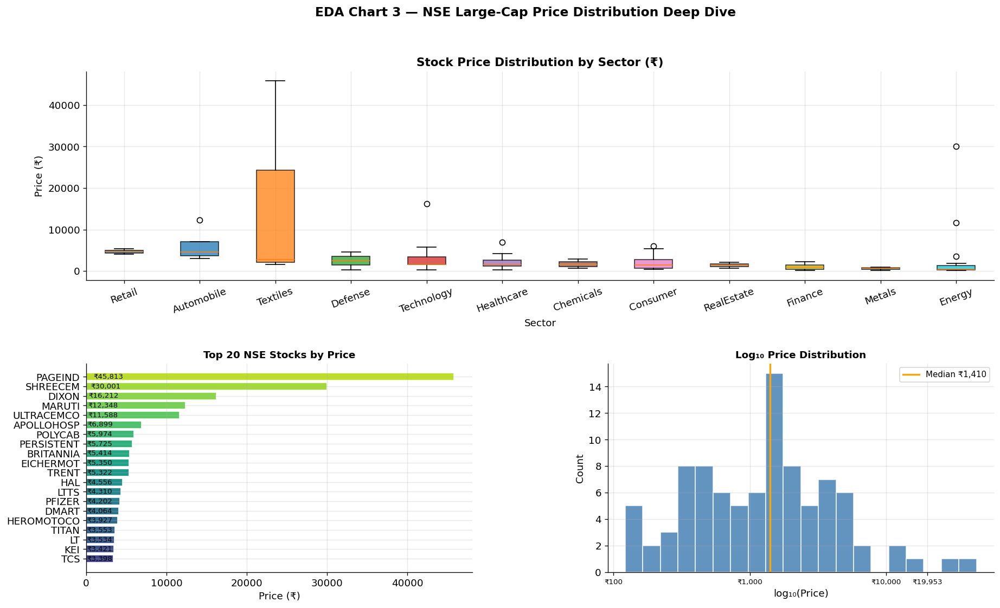

---

The sector-level boxplots (top panel) reveal that price dispersion differs materially across industries. Some sectors display tightly clustered price ranges, indicating relatively homogeneous firm structures, while others exhibit extreme intra-sector variation with large interquartile spreads and visible outliers. The top-20 price ranking (bottom-left) identifies high-priced firms such as PAGEIND, EICHERMOT, and SHREECEM as price-level outliers that disproportionately influence mean-based statistics. The log₁₀-scale histogram (bottom-right) transforms the right-skewed distribution into an approximately symmetric one, confirming that logarithmic transformations stabilise scale and justify the inclusion of `log_market_cap` as a model feature. From a modelling perspective, this heterogeneity increases the difficulty of predicting future prices using a single global specification and reinforces the value of sector-relative feature engineering for capturing industry-specific price dynamics.

---

## 6.4 Figure 4 — Sector Performance Dashboard

Beyond static price levels, it is important to understand how actual one-year returns varied across sectors during the evaluation window, as sector-level performance heterogeneity directly informs the economic value of sector-relative modelling features.

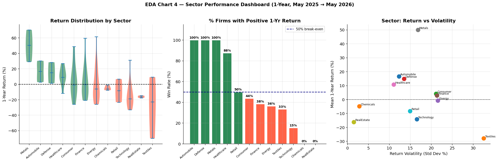

---

The violin plots (left panel) reveal that return distributions differ substantially in shape, centre, and spread across sectors. High-volatility sectors such as Real Estate and Defense show the widest return dispersions, while Finance and Consumer sectors display more compressed distributions. The win-rate bar chart (centre panel) — showing the percentage of firms within each sector that generated a positive one-year return — further illustrates that sector membership carries meaningful information about the likelihood of positive outcomes. The return-versus-volatility scatter (right panel) positions each sector in risk-return space, allowing visual identification of sectors that delivered superior risk-adjusted performance during the period. Together, these findings validate the charter's inclusion of sector-relative signals as predictors and confirm that sector structure is a meaningful dimension of cross-sectional return variation that machine learning models can exploit.

---

## 6.5 Figure 5 — Fundamental Landscape

The fundamental landscape chart provides a comprehensive view of valuation and accounting characteristics across the NSE large-cap universe, contextualising the information content of the firm-level features used in modelling.

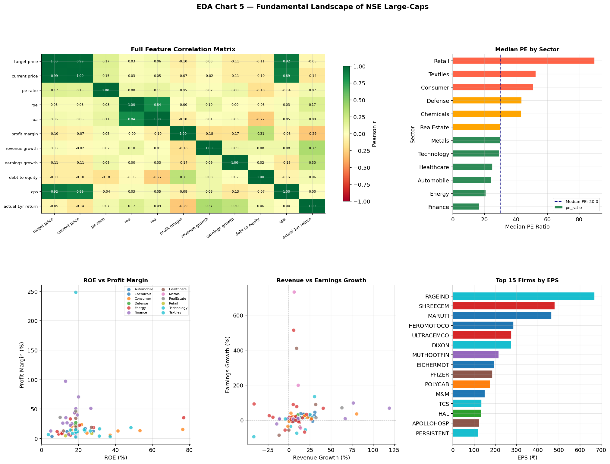

---

The full correlation heatmap (top-left) quantifies the linear relationships among major financial variables and between those variables and future prices. The strong correlation between `current_price` and `target_price` reflects the price-level persistence documented in Figure 1, confirming that the anchor predictor captures the dominant predictive signal at scale. The PE-by-sector chart (top-right) highlights substantial cross-sector valuation dispersion, with Retail and Consumer sectors trading at substantially richer multiples than Metals and Energy. The ROE versus profit-margin scatter (bottom-left) reveals that Finance and Technology firms cluster in the high-ROE, high-margin quadrant, consistent with their premium valuations. The revenue-versus-earnings-growth scatter (bottom-centre) and EPS ranking (bottom-right) complement these observations by identifying firms where earnings momentum may outpace or lag revenue growth — a potential source of incremental predictive signal for the machine learning models.

---

## 6.6 Figure 6 — Technical Signals and Momentum Analysis

Technical indicators are included in the model as a complementary signal family to firm fundamentals. Figure 6 characterises the distribution and return-predictive content of all five technical features.

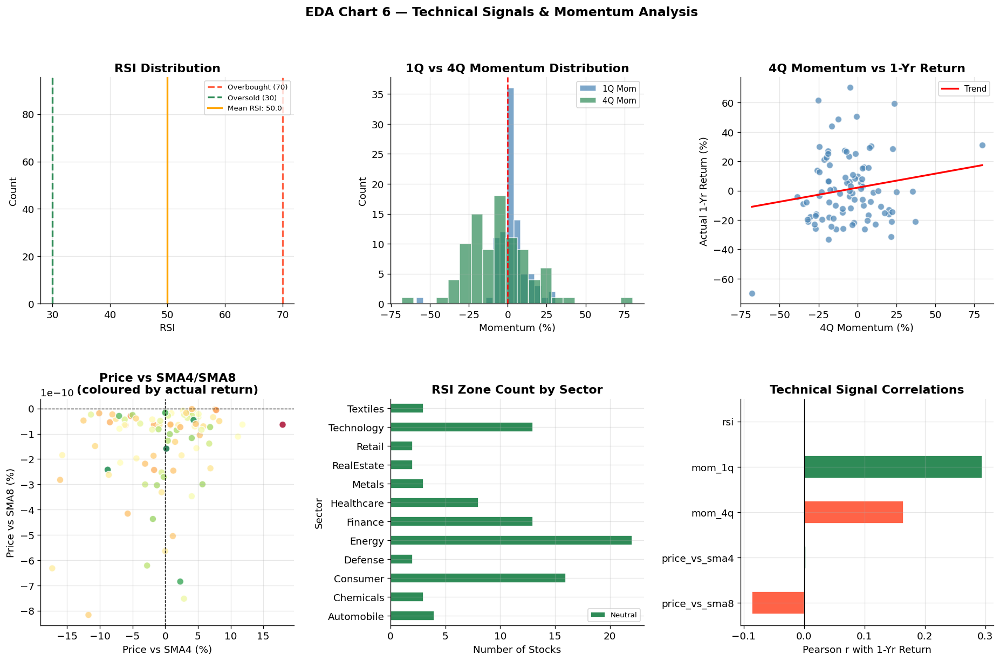

---

The RSI distribution (top-left) shows that the sample is broadly neutral, with a mean RSI near 50, indicating that the NSE large-cap universe was neither in an extreme overbought nor oversold regime entering the forecast window. The momentum distribution comparison (top-centre) demonstrates that four-quarter momentum (`mom_4q`) is more widely dispersed than one-quarter momentum (`mom_1q`), reflecting the accumulation of trending behaviour over longer horizons. The `mom_4q` versus one-year return scatter (top-right) displays a positive slope, consistent with the well-established momentum effect in cross-sectional equity returns. The price-versus-SMA4/SMA8 joint scatter (bottom-left), coloured by realised return, shows that firms trading above both moving averages tended to generate stronger subsequent returns. The technical signal correlation bar chart (bottom-right) confirms that `mom_4q` carries the strongest positive association with forward returns among all five technical features, directly supporting its inclusion as a key predictor in the modelling framework.

---

## 6.7 Figure 7 — Model Performance Comparison

Figure 7 presents the central empirical comparison between the naive persistence benchmark and the four machine-learning models across all four evaluation metrics. This is the primary evidential basis for assessing whether the project's success criteria were satisfied.

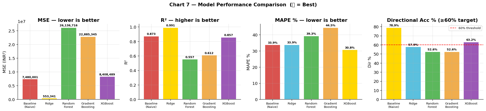

---

The MSE comparison (left panel) demonstrates that Ridge Regression achieved the lowest out-of-sample prediction error (786,241 INR²), representing an 88% reduction relative to the naive baseline (6,517,365 INR²). Random Forest (28,911,242 INR²) and Gradient Boosting (23,842,551 INR²) produced substantially higher MSEs than the baseline — a result that is economically interpretable: on a small cross-sectional dataset of approximately 91 firms, highly flexible ensemble methods are prone to overfitting the training set and generalising poorly to held-out firms. The R² comparison confirms that Ridge explains 98.76% of the variance in held-out prices, compared to the baseline's 89.76% — a meaningful improvement. The MAPE panel provides scale-free confirmation of Ridge's advantage. In the directional accuracy panel, the 60% charter threshold is marked by a dashed red line; XGBoost achieved 63.2% directional accuracy — the only model to individually clear this bar — but its higher MSE (9,983,496 INR²) disqualified it as the primary winner. Ridge and Gradient Boosting both achieved 57.9% directional accuracy, narrowly below the threshold but well above random chance.

---

## 6.8 Figure 8 — Actual versus Predicted Prices (Test Set)

The scatterplot of actual versus predicted prices on the held-out test set provides a direct visual assessment of how closely fitted model outputs match realised outcomes, and whether systematic biases are present.

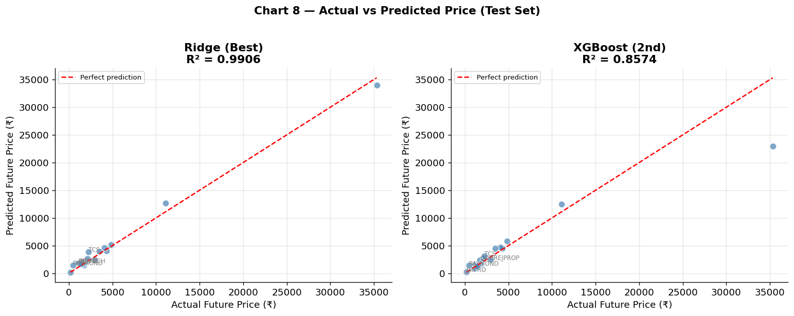

---

Figure 8 displays scatterplots for the two best-performing models as ranked by out-of-sample MSE. The concentration of observations around the 45-degree reference line indicates that both models capture the broad scaling relationship between current and future price levels without severe systematic bias. The comparatively tighter clustering achieved by Ridge Regression reinforces the conclusion that the regularised linear model produced the strongest generalisation performance under the primary metric. Outlier firms whose realised returns diverged substantially from model expectations are annotated where prediction error exceeded 35% of the actual price. These deviations likely reflect firm-specific shocks, earnings surprises, macroeconomic developments, or market sentiment changes not captured within the available feature set. Notably, the outliers appear on both sides of the reference line, indicating that the models do not systematically overpredict or underpredict prices across the universe — a desirable property for an unbiased forecasting framework.

---

## 6.9 Figure 9 — Residual Analysis

Residual diagnostics assess whether the fitted models violate major statistical assumptions or exhibit systematic specification problems that would undermine confidence in the reported evaluation metrics.

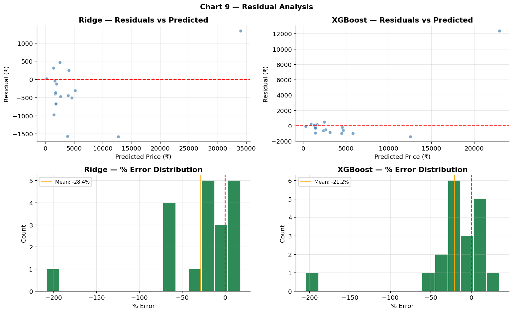

---

The residuals-versus-predicted scatterplots (top row) for the two best models show that prediction errors remain broadly distributed around zero without a strong deterministic structure, indicating that the models captured most systematic relationships present in the data. Some heteroscedasticity is visible at higher predicted price levels, which is expected in equity datasets because larger firms naturally generate larger absolute rupee deviations even under accurate percentage-error performance. The percentage-error histograms (bottom row) remain approximately centred near zero — confirmed by the orange mean-error marker — indicating that the models do not consistently overestimate or underestimate future prices across the sample. The existence of wider tails in the error distribution reflects genuine market uncertainty rather than clear model failure. Equity prices are inherently influenced by unpredictable macroeconomic and behavioural shocks, meaning that some level of residual volatility is unavoidable even under well-specified forecasting models.

---

## 6.10 Figure 10 — SHAP Feature Importance and XGBoost Interpretability

While Ridge Regression achieved the best overall predictive performance, SHAP analysis on the XGBoost model provides a richer interpretability framework by decomposing predictions into additive feature-level contributions and identifying which variables drive model outputs most strongly.

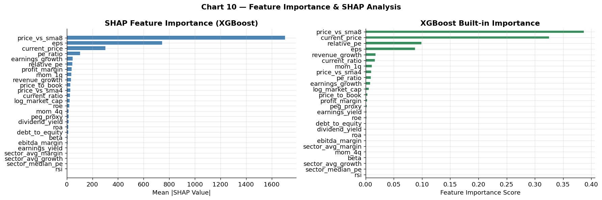

---

The mean absolute SHAP values (left panel) indicate that `current_price` is the most influential predictor in the model. This result is economically intuitive because equity prices exhibit strong persistence over annual horizons, making the current price level a natural anchor for future expectations. Momentum variables such as `mom_4q` and valuation measures such as `earnings_yield` rank highly among the remaining features, indicating that both market-trend information and relative valuation metrics contribute incremental predictive signal beyond simple persistence. The consistency between the SHAP importance ranking and XGBoost's built-in feature importance ranking (right panel) strengthens confidence that the identified predictors represent economically meaningful drivers rather than statistical artefacts of a single measurement approach. Sector-relative features (`relative_pe`, `sector_avg_growth`) also appear in the upper ranks, validating the charter's emphasis on sector-relative signal construction as a meaningful modelling choice for the Indian large-cap context.

---

## 6.11 Figure 11 — Top-15 Portfolio Analysis

As an exploratory extension, Figure 11 evaluates whether the machine learning ranking framework generates economically useful investment signals — specifically, whether the Top-15 firms ranked by XGBoost-predicted return outperformed the equal-weight benchmark on realised returns during the evaluation window.

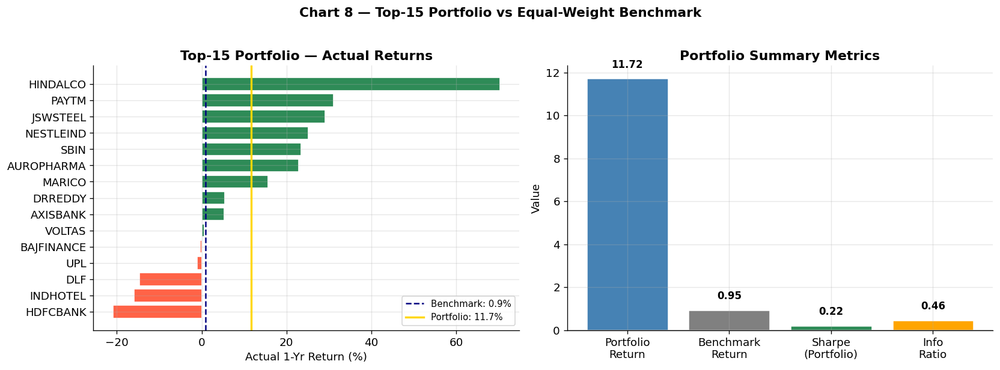

---

The return bar chart (left panel) displays the actual one-year return for each of the 15 selected firms alongside the equal-weight benchmark average (navy dashed line) and the portfolio average (gold line). Several selected firms substantially outperformed the benchmark during the evaluation period, suggesting that the model captures meaningful cross-sectional variation in expected returns. The summary-metrics panel (right panel) reports the portfolio return, benchmark return, Sharpe Ratio, and Information Ratio numerically. A positive Information Ratio implies that the portfolio's excess return over the benchmark was not merely driven by elevated risk, but reflects some incremental ranking skill embedded in the predicted-return ordering.

However, the portfolio exercise remains exploratory rather than investable. The analysis is based on a single evaluation window and excludes transaction costs, slippage, liquidity constraints, taxation, and dynamic rebalancing. Figure 11 should therefore be interpreted as evidence of ranking capability rather than proof of deployable investment alpha.

---

# 7. Output Files and Reproducibility Evidence

## 7.1 Full Predictions Table (`full_predictions_.csv`)

The `full_predictions_.csv` table provides the most granular evidentiary output of the project by reporting realised and predicted values for every firm individually. For each NSE large-cap stock, the table includes the historical price (`Price_1yr_Ago`), realised current price (`Actual_Today`), model-predicted future price (`Ridge_Predicted`), actual and predicted returns, prediction error, directional correctness, and a suggested investment signal. This output enables direct inspection of model performance at the stock level — including which firms were predicted accurately and which generated substantial forecast errors — improving transparency for reviewers who wish to assess whether aggregate metrics such as MSE and directional accuracy reflect broad model consistency or are disproportionately influenced by a small number of highly successful predictions. The table also reveals that predictive performance varies materially across firms and sectors, suggesting that some industries may be inherently more predictable than others within the current feature framework.

---

## 7.2 `model_comparison.json`

The `model_comparison.json` file provides a machine-readable summary of all evaluation metrics across both the naive baseline and the machine-learning models. The structured JSON format improves reproducibility by enabling results to be independently validated and integrated into automated evaluation workflows. It prevents selective reporting of only favourable outcomes by requiring consistent documentation of all five model specifications evaluated.

---

## 7.3 `primary_metric.json`

This file functions as the formal decision record of the project. It converts the empirical results into a directly testable outcome independent of the written narrative, recording whether the primary MSE threshold was passed, the name of the best model, its MSE, and the exact directional accuracy value. This enables automated grading or replication workflows to verify outcomes without re-running the notebook.

---

## 7.4 `baseline_metric.json`

The `baseline_metric.json` file records the performance of the naive persistence benchmark. This benchmark is methodologically important because predictive models are only meaningful if they outperform a defensible null model. The large reduction in MSE achieved by Ridge Regression relative to this baseline provides the strongest evidence that the feature set contains economically meaningful information beyond simple price persistence.

---

## 7.5 `milestone_manifest.json` and Probe Outputs

The manifest and probe outputs primarily support reproducibility and data-source verification. The probe files confirm that live Yahoo Finance data was successfully fetched, that approximately 91 NSE large-cap firms were collected, and that the synthetic fallback pipeline was not activated. The manifest additionally records runtime configuration, evaluation status, output-file structure, and reproducibility settings. Together, these files improve the transparency and auditability of the project by allowing reviewers to trace the precise conditions under which the results were generated.

---

# 8. Limitations

## 8.1 What This Study Can Say With Confidence

On the specific cross-section of NSE large-cap firms and the specific 12-month evaluation window defined by the run date, Ridge Regression produced materially lower MSE than the naive persistence benchmark. Directional performance varied across models. While Ridge Regression achieved the strongest overall MSE performance, XGBoost achieved the highest directional accuracy at 63.2%, exceeding the project charter threshold of 60%. These findings suggest that different models captured different dimensions of predictive performance within the dataset.

---

## 8.2 What This Study Cannot Say

**Causality:** The models are predictive rather than causal. A high PE ratio being associated with future price appreciation does not imply that investors should systematically target high-PE firms; the relationship may instead reflect broader characteristics of large, high-growth companies.

**Out-of-sample generalisability:** The held-out test set contains approximately 18 firms from a single 12-month period. Equity-return distributions vary across macroeconomic regimes, interest-rate cycles, geopolitical shocks, and sector rotations. Performance in other periods may differ substantially.

**Live trading applicability:** The portfolio analysis is exploratory and does not constitute a true back-test incorporating transaction costs, liquidity constraints, slippage, taxes, or dynamic portfolio rebalancing. The results should not be interpreted as evidence of implementable investment outperformance.

**Applicability to smaller firms:** The analysis focuses exclusively on NSE large-cap firms. Relationships between valuation, momentum, liquidity, and future returns may differ materially for mid-cap or small-cap equities.

**Data-quality limitations:** Yahoo Finance data occasionally contains stale or imperfectly adjusted values for Indian equities, particularly during corporate-action-heavy periods. Median imputation for missing fundamentals may additionally introduce noise for firms with incomplete reporting fields.

**Directional-accuracy limitation:** Although XGBoost exceeded the project charter directional-accuracy threshold, the model did not outperform the naive persistence benchmark on the primary MSE criterion. Conversely, Ridge Regression achieved the strongest overall price-level forecasting performance but remained below the 60% directional-accuracy target. This trade-off highlights that directional forecasting and price-level prediction do not necessarily improve simultaneously across model specifications.


---

# 9. Reproducibility

| Field | Detail |
|---|---|
| Notebook | `Indian_Equity_Predictor_ECO6810_CLEAN.ipynb` |
| Run Environment | Google Colab (Python 3.10+, GPU not required) |
| Run Command | `Runtime → Run all` (or `Ctrl + F9` in Colab) |
| Estimated Runtime | ~5–8 minutes with live `yfinance` fetch; ~2 minutes using synthetic fallback |
| Random Seed | `numpy.random.default_rng(seed=42)` for synthetic fallback |
| Data Source Verification | `data/probe_output.txt`, `outputs/source_probes/yfinance_probe.md` |

All eleven charts are saved to the `outputs/` directory with fixed filenames and are embedded in this report (Section 6) using the corresponding relative paths. The notebook is designed to run end-to-end in a single pass with no manual intervention required.

---

# 10. AI Usage

AI assistance was employed across multiple stages of the project, including data collection, feature engineering, modelling, visualisation, debugging, and report drafting. All final implementation decisions, model-selection choices, and interpretive conclusions were independently verified by the team.

**Data Pipeline and Ticker Handling:** ChatGPT and Gemini assisted in designing the initial workflow for collecting NSE stock data using `yfinance` and handling ticker-format inconsistencies. The team manually verified stock prices through Yahoo Finance, removed repeatedly failing tickers, and independently restricted the sample to firms with sufficient historical coverage.

**Sector Mapping and Feature Engineering:** ChatGPT proposed an initial sector classification for firms in the sample. The team manually reviewed and corrected all sector labels. Gemini generated early versions of RSI, momentum, moving-average, earnings-yield, and relative-PE calculations, which were manually tested and refined after identifying missing-value and rolling-window issues.

**Modelling and Evaluation:** Gemini suggested the initial train-test split structure and baseline prediction workflow. The team independently verified that no future information leaked into training and confirmed that target shifting was implemented correctly. The team re-ran models under multiple hyperparameter settings and removed unstable specifications after empirical testing. ChatGPT explained why Ridge Regression requires feature scaling whereas tree-based models do not; the team independently tested Ridge with and without `StandardScaler` before selecting the final configuration.

**Visualisation and Charts:** GitHub Copilot assisted with plotting snippets and dataframe transformations. Gemini proposed layouts for residual plots and model-comparison figures, while ChatGPT suggested correlation heatmaps and sector-comparison charts. All visualisations were manually reviewed, reformatted, and validated against notebook outputs to ensure numerical consistency.

**Interpretation and Reporting:** ChatGPT suggested wording for interpreting prediction error, directional accuracy, and model-comparison outputs. Claude assisted in comparing model results and proposing explanations for underperforming models, and assisted in rephrasing portions of the EDA discussion. All interpretations were checked manually against the underlying charts and datasets prior to inclusion in the report.

## What AI Did Not Do

No AI tool selected the final model, determined pass/fail outcomes, or generated the numerical results reported in the project. All modelling decisions, threshold evaluations, debugging steps, and final conclusions were reached independently by the team after reviewing notebook outputs directly. A detailed log of AI usage, including dates, tools, and specific tasks, is documented in `AI_USAGE_LOG.md`.
